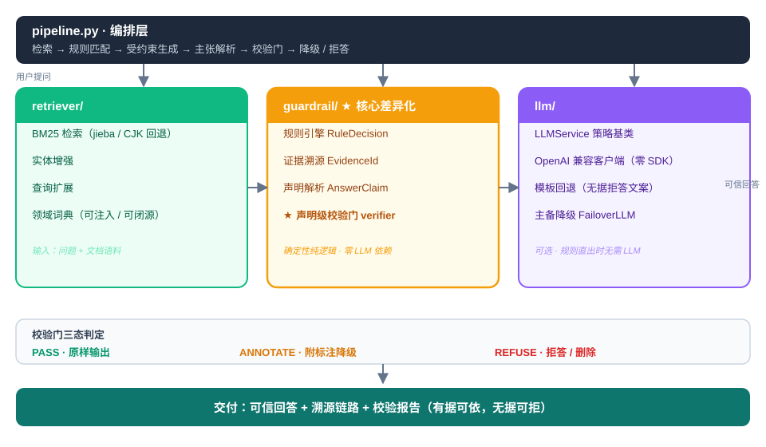

# GroundedRAG

[](LICENSE)
[](https://www.python.org/)
[](https://github.com/StevenTsai/grounded-rag)
[](tests/)
[](docs/metrics.md)
[](https://github.com/StevenTsai/grounded-rag/actions)

Lightweight open-source RAG framework with claim-level deterministic verifier — reducing hallucinations by refusing claims that lack evidence, not just generating them.

GroundedRAG is designed for high-risk domains (medical, legal, finance) where hallucination is dangerous: every answer is decomposed into atomic claims (`AnswerClaim`), each bound to traceable evidence (`EvidenceId`) or authoritative rules (`RuleDecision`), then passed through a deterministic verifier gate before deciding **PASS / ANNOTATE / REFUSE**.

> ⚠️ Data in `examples/` is **synthetic** for demonstration and benchmarking only. **Not medical advice.**

## Why "Claim-Level"?

Traditional RAG scores "overall relevance" — the model can fabricate a paragraph that *looks* like retrieval results while sneaking in hallucinations. GroundedRAG reduces answers to **one claim = one checkable assertion**, verified independently:

```
AnswerClaim[] ──bound to──▶ EvidenceId[] / RuleDecision[]
      │
      ▼  (pure logic, zero LLM dependency)
 Citation Completeness → Surface Consistency → Rule Conflict Arbitration → Evidence Sufficiency
      │
      ▼
  PASS (deliver as-is) / ANNOTATE (flag with disclaimer) / REFUSE (reject/delete)
```

The deterministic tier checks **surface element consistency** (entities/numbers/units present in evidence text), not semantic entailment. Relational claims (negation/comparison/causal) are refused when the semantic tier is off. See [docs/metrics.md](docs/metrics.md) for details.

## Quick Start

```bash
pip install -e ".[demo]"     # or minimal: pip install -e .
python examples/demo.py      # CLI end-to-end demo
python examples/app.py       # Gradio interactive demo
```

Works **without any API key**: rule hits produce answers directly ("rule-direct"), misses produce structured refusal.

```python
from groundedrag.pipeline import Pipeline

pipe = Pipeline.build_from_json(
    "examples/seed_docs.jsonl", "examples/seed_rules.json"
)
result = pipe.ask("EGFR mutation stage IV NSCLC first-line?")
print(result.answer_text)
# - NSCLC 1L EGFR: Osimertinib
```

Enable a real LLM (OpenAI-compatible endpoint):

```python
from groundedrag.llm import FailoverLLM, OpenAICompatibleLLM

llm = FailoverLLM([OpenAICompatibleLLM(base_url="https://api.deepseek.com/v1",
                                        api_key="sk-...", model="deepseek-chat")])
pipe = Pipeline.build_from_json("examples/seed_docs.jsonl",
                                "examples/seed_rules.json", llm=llm)
```

Or configure via `.env` (supports multi-provider failover):

```bash
cp .env.example .env
# edit .env — set LLM_API_KEY or provider-specific keys (DEEPSEEK_API_KEY, etc.)
```

## Benchmarks

### Verify Mode (deterministic gate, no LLM needed)

```bash
python -m groundedrag.eval --json
```

Built-in reproducible benchmark: **19 cases, 24 claims** (positive, numerical hallucination, relational rejection, evidence-side negation flip, type-reporting bypass, rule conflict).

| Metric | Description |
|--------|-------------|
| **Citation Completeness Rate** | Claims that should pass — actually have complete, parseable citation anchors |
| **Surface Consistency Rate** | Claims that should pass — actually passed (no false refusal) |
| **Refusal Correctness Rate** | Claims that should refuse — actually refused (**key anti-hallucination metric**) |

**Results: all metrics = 1.0** (12/12 hallucination-prone claims intercepted, 10/10 good claims passed, 2/2 annotations correct).

| Comparison (same hallucination-prone questions) | Naive Prompt RAG | GroundedRAG |
|------|------|------|
| Refusal accuracy (hallucination catch) | ≈ 0 (always answers) | **1.0** (12/12 caught) |
| False refusal (good claims blocked) | — (no refusal concept) | 0 (10/10 passed) |
| Citation / traceability | None | Every claim has `[evidence_n]` / `[rule_n]` anchors |

See [docs/comparison.md](docs/comparison.md) for methodology and case studies.

### E2E Mode (full RAG pipeline with LLM)

```bash
cp .env.example .env   # configure API key
python -m groundedrag.eval --e2e
```

End-to-end evaluation: retrieval → LLM generation → claim parsing → verifier gate. Supports multiple LLM providers with automatic failover (xiaomi / deepseek / doubao). See [src/groundedrag/eval/README.md](src/groundedrag/eval/README.md) for details.

## Architecture



```
pipeline.py orchestration: Retrieval → Rule Matching → Constrained Generation → Claim Parsing → Verifier → Degrade/Refuse
   retriever/              guardrail/ ★               llm/
  BM25 retrieval           Rule Engine RuleDecision   Strategy base + multi-model failover
  Entity enhancement       Evidence Traceability       OpenAI-compatible HTTP client
  Query expansion          Claim Parsing               Template fallback (structured refusal)
  (injectable dictionary)  ★ Claim-level Verifier
```

- **`retriever/`**: BM25 (jieba tokenization; falls back to **CJK char-bigram** when jieba is missing, never raw `split()`) + entity enhancement + query expansion. Domain synonym dictionaries are injectable.
- **`guardrail/`** (★ core differentiator): Pure Python rule engine (no ORM), EvidenceId traceability, AnswerClaim parsing, verifier gate (citation → surface consistency → conflict arbitration → sufficiency).
- **`llm/`**: `LLMService` strategy base + OpenAI-compatible native HTTP client (zero SDK) + template fallback + failover.
- **`eval/`**: Built-in benchmark runner (verify mode + e2e mode), multi-provider LLM config via `.env`.
- **`pipeline.py`**: Orchestration (`Pipeline.build_from_json(...).ask(...)`).

## What Makes This Different

| Dimension | RAG-Verifier / Haystack ClaimChecker / Open-FactCheck | **GroundedRAG** |
|-----------|------|------|
| Verification logic | NLI model scoring | **Pure logic, zero LLM** |
| Output states | Binary (pass/fail) | **Three-state (PASS/ANNOTATE/REFUSE)** |
| Rule conflict resolution | ❌ | **✅ 4-step arbitration** |
| Anti cross-evidence stitching | ❌ | **✅ Anchoring mechanism** |
| Rule-direct (no LLM needed) | ❌ | **✅ Authority-backed answers** |
| Domain adaptation | Generic | **Medical-grade (staleness, grade, conflict)** |
| Reproducibility | Depends on model | **Fully deterministic** |

> GroundedRAG is not "another claim checker" — it is a **complete trustworthy RAG pipeline** that engineers claim-level verification into deterministic decision tables, solving "how to make LLMs stop fabricating after retrieval" rather than "how to judge if a sentence is supported by evidence."

## Project Structure

```
grounded-rag/
├── src/groundedrag/
│   ├── retriever/      # bm25.py + retriever.py
│   ├── guardrail/      # models/engine/provider/evidence/claims/verifier ★
│   ├── llm/            # base/openai_compat/template/failover
│   ├── eval/           # Benchmark runner (verify + e2e modes)
│   └── pipeline.py     # Trustworthy QA orchestration
├── examples/           # Seed data, eval sets, demo.py, app.py
├── tests/              # pytest unit tests
├── tools/leak_scan.py  # Open source compliance scanner
├── docs/               # Metrics / comparison / architecture
└── .env.example        # LLM provider configuration template
```

## Roadmap

- **v1.1 (2026 Q4)** — Semantic tier: NLI model integration, relational claim verification
- **v1.2 (2027 Q1)** — OncoKG: knowledge graph evidence chain, entity-relation-level traceability
- **v1.3 (2027 Q2)** — Multi-LLM alignment: consensus voting, self-consistency verifier
- **v2.0 (2027 Q3)** — Multi-domain: finance/legal/education rule DSL + plugin system

## Acknowledgements

GroundedRAG evolved from the production practice of the **onco-hub** medical data platform (47,000+ medical records + CSCO guideline rules). The framework is open-sourced with synthetic demo data (`examples/`) for any vertical domain to reuse.

## Contributing

See [CONTRIBUTING.md](CONTRIBUTING.md) (includes 7-point compliance checklist + red-line table).

## License

MIT © 2026 GroundedRAG Contributors. See [LICENSE](LICENSE).

**[中文文档](README.zh-CN.md)**
